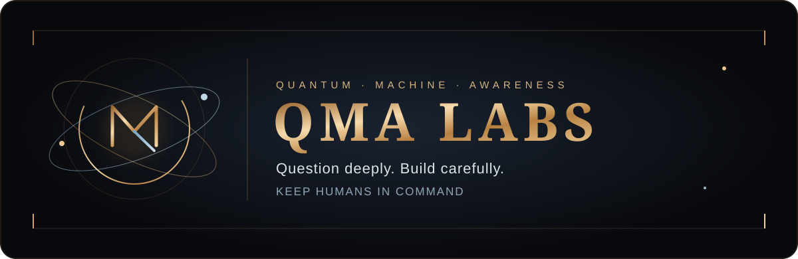

<div align="center">



### Building intelligent systems that are useful, understandable, private, and built to last.

[](https://github.com/QMA-Labs?tab=repositories)
[](#the-north-star)
[](#how-i-build)
[](https://masihanayeri.com)

**AI systems · developer tools · education · automation · local-first software · quantum-inspired ideas**

</div>

---

## Hello — I’m Masiha

I’m an independent builder working at the intersection of **artificial intelligence, thoughtful product design, education, privacy, and automation**. QMA Labs is the public home for that work: a place where ambitious ideas are turned into software people can actually install, understand, test, and use.

I am interested in more than making a model return an impressive answer. I care about the complete experience around intelligence: how a system explains itself, how it protects the person using it, how it behaves when uncertain, how safely it can act, and whether a beginner can benefit from it without first becoming an expert.

My work moves between research-minded exploration and practical engineering. One day that may mean studying how an intelligent assistant can teach instead of merely correcting. Another may mean designing a safer automation flow, improving a local inference experience, building an editor integration, packaging a Windows release, or rewriting documentation until a first-time user can succeed without help.

> **The goal is not AI that looks clever for a demo. The goal is intelligence that earns trust through clarity, usefulness, and restraint.**

---

## The north star

I want to help build a future where intelligent software feels less like a black box and more like a capable partner—one that respects human judgment instead of replacing it.

That direction is guided by four long-term themes:

| | Direction | What it means in practice |
|---:|---|---|
| 🧠 | **Explainable intelligence** | Systems should show the reasoning, evidence, uncertainty, and next useful step—not only an output. |
| 🔒 | **Private-by-default computing** | Whenever practical, personal work should stay local, require no account, and avoid unnecessary telemetry. |
| 🌱 | **Technology that teaches** | Good tools should leave the user more capable after every interaction, especially when the user is still learning. |
| 🛡️ | **Safe, reversible automation** | Automated actions should be previewable, confidence-aware, limited in scope, and easy to undo. |

These ideas are intentionally broader than any single repository. Individual experiments will change; the direction should remain recognizable.

---

## What I do today

I take ideas through the full product journey instead of stopping at a prototype:

```text
Problem discovery
      ↓
Product and learning design
      ↓
Architecture and implementation
      ↓
Safety boundaries and failure handling
      ↓
Tests, packaging, documentation
      ↓
Real installation and beginner usability
      ↓
Feedback, refinement, and the next version
```

The work usually combines several layers:

- **AI and analysis engines** that produce structured, testable results.
- **Human-centered interfaces** that turn complexity into clear choices.
- **Developer and learning tools** that meet people inside their existing workflow.
- **Local services and integrations** that remain useful without a cloud dependency.
- **Deterministic safety checks** around actions that can modify a user’s work.
- **Documentation and packaging** treated as part of the product, not an afterthought.
- **Persian and English accessibility** so useful technical ideas can reach more learners.

I enjoy the difficult middle ground between a research idea and a dependable product: the point where architecture, interface, reliability, security, teaching, and empathy all have to work together.

---

## How I build

### 1. Start with the human problem

Technology is only interesting when it changes someone’s experience for the better. I begin by asking where the person is confused, blocked, exposed to risk, or spending attention on work that should feel simpler.

### 2. Make intelligence inspectable

If a system suggests a diagnosis or a change, the user should be able to see what it found, why it matters, how confident it is, and what will happen next. Strong products do not hide uncertainty behind confident language.

### 3. Prefer local capability

Cloud services can be valuable, but they should not be the automatic answer. I look for designs that keep data on the user’s machine, work offline when possible, and make network use an explicit choice.

### 4. Automate carefully

The closer software gets to acting on behalf of a person, the more important previews, boundaries, validation, and undo become. Convenience should never require surrendering control.

### 5. Finish the last mile

A feature is not finished because it works on the developer’s computer. Installation, sensible defaults, readable errors, sample files, troubleshooting, and honest limitations determine whether a real person can benefit from it.

---

## The longer horizon

The work at QMA Labs is moving toward a connected family of systems with a shared philosophy:

### Near horizon

- Better local assistants that understand context without collecting unnecessary data.
- Teaching experiences that adapt their hints while still letting the learner think.
- Safer “fix it for me” workflows with visible changes and strict confidence boundaries.
- Installation and onboarding that feels natural to people who are new to programming.

### Growing direction

- Tools that remember progress without turning learning history into surveillance.
- Interfaces that combine deterministic analysis with carefully bounded generative AI.
- Reusable foundations for desktop, editor, and local-service experiences.
- Stronger evaluation: not just “did it answer?” but “was it correct, helpful, safe, and educational?”

### Long-term ambition

- Human–AI systems that support reflection, creativity, learning, and responsible action.
- Intelligence that can cooperate across tools while preserving local ownership and clear consent.
- Exploration of quantum-inspired computation and new system architectures where they offer real value—not just futuristic branding.
- Products that feel advanced under the hood and calm, clear, and humane on the surface.

This roadmap is a direction, not a promise of hype. I would rather publish a smaller system with honest boundaries than a larger claim that cannot be demonstrated.

---

## Principles I keep returning to

<table>
<tr>
<td width="50%" valign="top">

### Build with evidence

Tests, reproducible behavior, clear release notes, and real installation checks matter more than a polished claim.

</td>
<td width="50%" valign="top">

### Respect the user

No hidden telemetry, manipulative defaults, or silent actions. The person remains the decision-maker.

</td>
</tr>
<tr>
<td width="50%" valign="top">

### Explain the difficult part

Complexity should be handled by the product, not pushed onto the learner or end user.

</td>
<td width="50%" valign="top">

### Stay ambitious and honest

Explore big ideas, document limits, and separate what works today from what is still a direction.

</td>
</tr>
</table>

---

## The technology layer

The exact stack changes with the problem, but the recurring toolkit includes:

<div align="center">


</div>

The more important “stack,” though, is a way of working: **structured outputs, conservative automation, local ownership, measurable quality, beginner empathy, and transparent limitations.**

---

## Building in public

This profile is a living record of exploration and product-building. Repositories may begin as an experiment, grow into a useful tool, or teach a lesson that shapes the next system. What connects them is the attempt to move from an interesting idea to something concrete and inspectable.

If you are exploring human-centered AI, local-first software, educational tooling, privacy-aware automation, or responsible developer experiences, you will probably find something familiar here.

<div align="center">

[**Explore the repositories**](https://github.com/QMA-Labs?tab=repositories) · [**Visit the website**](https://masihanayeri.com)

</div>

---

## A note for Persian-speaking builders

بخش مهمی از هدف من این است که ابزارهای فنی و هوش مصنوعی فقط برای افراد باتجربه یا انگلیسی‌زبان قابل استفاده نباشند. مستندات روشن، آموزش قدم‌به‌قدم و تجربهٔ کاربری مناسب برای تازه‌کارها بخشی از خود محصول است، نه یک ویژگی فرعی.

من به ساخت ابزارهایی علاقه دارم که کاربر بعد از استفاده از آن‌ها فقط به جواب نرسد، بلکه **دلیل، روش حل و مسیر بهتر فکرکردن** را هم یاد بگیرد.

---

<div align="center">

### Build useful intelligence. Keep people in control.

**QMA Labs** · Independent AI systems, thoughtful automation, and tools that teach.

</div>
